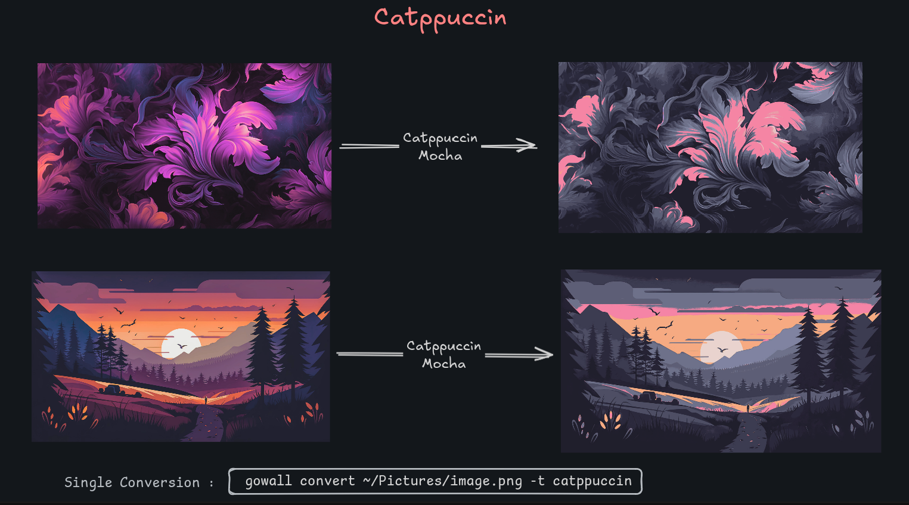
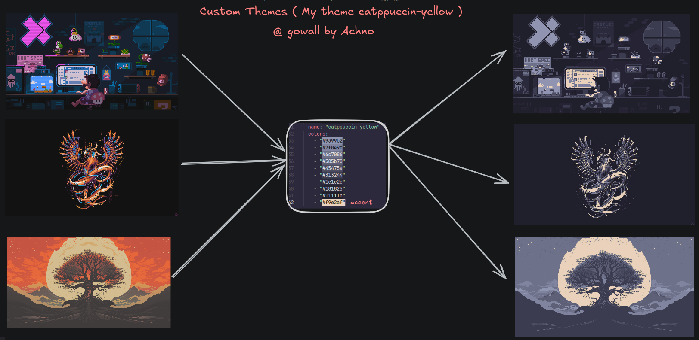
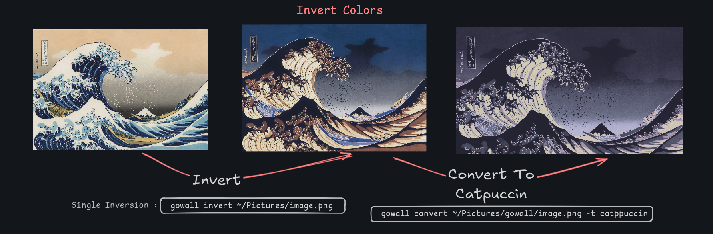
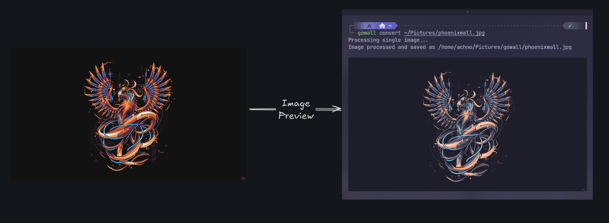

###### *<div align = right><sub>Design By Achno</sub></div>*
<div align = center><br><br>

&ensp;[<kbd> <br> Overview <br> </kbd>](#overview)&ensp;
&ensp;[<kbd> <br> Themes <br> </kbd>](#themes)&ensp;
&ensp;[<kbd> <br> Usage <br> </kbd>](#usage)&ensp;
&ensp;[<kbd> <br> Installation <br> </kbd>](#installation)&ensp;
&ensp;[<kbd> <br> Contributions <br> </kbd>](#contributions)&ensp;
<br><br><br><br></div>


```

 ██████╗  ██████╗ ██╗    ██╗ █████╗ ██╗     ██╗         ██████╗ ██╗   ██╗     █████╗  ██████╗██╗  ██╗███╗   ██╗ ██████╗ 
██╔════╝ ██╔═══██╗██║    ██║██╔══██╗██║     ██║         ██╔══██╗╚██╗ ██╔╝    ██╔══██╗██╔════╝██║  ██║████╗  ██║██╔═══██╗
██║  ███╗██║   ██║██║ █╗ ██║███████║██║     ██║         ██████╔╝ ╚████╔╝     ███████║██║     ███████║██╔██╗ ██║██║   ██║
██║   ██║██║   ██║██║███╗██║██╔══██║██║     ██║         ██╔══██╗  ╚██╔╝      ██╔══██║██║     ██╔══██║██║╚██╗██║██║   ██║
╚██████╔╝╚██████╔╝╚███╔███╔╝██║  ██║███████╗███████╗    ██████╔╝   ██║       ██║  ██║╚██████╗██║  ██║██║ ╚████║╚██████╔╝
 ╚═════╝  ╚═════╝  ╚══╝╚══╝ ╚═╝  ╚═╝╚══════╝╚══════╝    ╚═════╝    ╚═╝       ╚═╝  ╚═╝ ╚═════╝╚═╝  ╚═╝╚═╝  ╚═══╝ ╚═════╝ 

```

# Overview :framed_picture:

Gowall is a tool to convert an image ( specifically a wallpaper ) to any color-scheme / pallete you like! 

## Features 
- It supports `single` and `batch` conversion of images to any of the available themes below.
- It can convert whole `directories` with the `#` delimiter, check `Usage` section
- It also has the ability to `invert` the colors of the image and convert them later
- Supports `Custom themes` Create your own theme by creating `~/.config/gowall/config.yml` more details at the `Theme` section!
- It supports  `image preview` ❗ by printing the image on the terminal on `kitty`. If you are running on an terminal emulator other than kitty it will just open your default image viewing
  application no matter the operating system. ( You can disable this, check `Usage` section )
- It supports `color pallete extraction` from an image (like pywal, Check `Usage` section for more information )
- It supports `changing image format` fast for example from `.webp` --> `.png`  

### Supported formats

`png` `jpeg` `jpg` `webp`

### Planned features

1. `TUI` : Will also have a pretty TUI version made with `bubbletea`
   
<div align = center><br><br>

<div align = center><br><br>

<div align = center><br><br> <div>

<div align = left>
  
# Themes :art:

The currently supported themes are featured below, if your favourite theme is missing open an issue or a pull request

All themes can be shown (both default and user-created via `~/.config/gowall/config.yml`) by `gowall list`

- **Catppuccin Mocha**
- **Nord**
- **Everforest**
- **Solarized**
- **Gruvbox**
- **Dracula**
- **Tokyo-dark/storm/moon**
- **Onedark**
<details>
  <summary><strong>Click to see more themes</strong></summary>
  <ul>
    <li><strong>Material</strong></li>
    <li><strong>Atom One Light</strong></li>
    <li><strong>Sweet</strong></li>
    <li><strong>Synthwave 84</strong></li>
    <li><strong>Atom Dark</strong></li>
    <li><strong>Oceanic Next</strong></li>
    <li><strong>Shades of Purple</strong></li>
    <li><strong>Arc Dark</strong></li>
    <li><strong>Sunset Aurant</strong></li>
    <li><strong>Sunset Saffron</strong></li>
    <li><strong>Sunset Tangerine</strong></li>
    <li><strong>Cyberpunk</strong></li>
    <li><strong>Night Owl</strong></li>
    <li><strong>Github Light (black & white)</strong></li>
   
  </ul>
</details>

<br>

#### Community Themes 🌐

Themes that were requested by the community and added to `gowall`

- **Srcery**

### Create your own Theme 

Step 1. Create the directory and file : `~/.config/gowall/config.yml`

Step 2. Paste the below template and change the name and hex values for your theme

```yml
themes:
  - name: "placeholder1"
    colors:
      - "#F5E0DC"
      - "#F2CDCD"
      - "#F5C2E7"
      - "#CBA6F7"
      - "#F38BA8"
      - "#EBA0AC"
      - "#FAB387"
      - "#F9E2AF"
      - "#A6E3A1"
      - "#94E2D5"
      - "#89DCEB"
      - "#74C7EC"
      - "#89B4FA"
      - "#B4BEFE"
      - "#CDD6F4"
      - "#BAC2DE"
      - "#A6ADC8"
      - "#9399B2"
      - "#7F849C"
      - "#6C7086"
      - "#585B70"
      - "#45475A"
      - "#313244"
      - "#1E1E2E"
      - "#181825"
      - "#11111B"
  - name: "placeholder2"
    colors:
      - "#F73253"
      - "#FA39DF"
      - "#005382"
      - "#123456"
```
Notes 🗒️ :
- Duplicate theme names will not be loaded

# Usage :gear:


1.  `Singe conversion`

  ```bash
    gowall convert path/to/img.png -t <theme-name>
  ```

Notes 🗒️ : 
- `path/to/img.png` does not have to be an absolute path. You can use a relative path with the `~` ex. `~/Pictures/img.png` 
- you can find the list of all the themes via `gowall list` check number 6. as well

<br>

2. `Batch conversion`

   ```bash
     gowall convert -b path/img.png,path/im2.png -t <theme-name-lowercase>
   ```

   ⚠️ Do not leave any white spaces between the comma `,` , do it like this :  `path/img.png,path/im2.png`
<br>

3. `Invert colors`

   ```bash
    gowall invert path/to/img.png
   ```
   You can also batch invert colors with :

   ```bash
    gowall invert -b path/img.png,path/img2.png
   ```
   <br>

4. `Convert a whole Directory`

   Use the `#` delimiter to convert every image file under that directory
   
   ```bash
    gowall convert ~/Pictures/# -t catppuccin

    gowall invert ~/Pictures/test/# 
   ```
   Notes 🗒️ : Only `png` `jpeg` `jpg` `webp` images will be converted any other directory or other file will be ignored

   <br>

6. `List all theme names`

   ```bash
    gowall list
   ```
   Notes 🗒️: You can view the colors of a theme by using the `-t` flag
    Example:
   ```bash
    gowall list -t catppuccin
   ```
   You can also open up a hex preview app in your default browser via the `-p` flag
   Example : `gowall list -pt catppuccin`
   
<br> 

7. `Image previewing`
   
   Image previewing is available for single image processing and is `ON` by default

   Examples : `gowall convert ~/Pictures/img.png` and `gowall invert ~/Pictures/img.png`

   You can disable it by adding the following inside your `~/.config/gowall/config.yml`

   ```yml
   EnableImagePreviewing: false
   ```

   <div align = center><br><br>

   <br>


8.  `Pallete extraction` ( Like pywal )

    You can extract the color pallete of an image as shown below : 

    ```bash
    gowall extract /path/to/img.png -c 6
    ``` 

    The `-c` flag specifies how many hex color codes to return ( Personally i recommend between 6-16 with 6-7 being my go to).
    This will print the color codes to the terminal. In order for you to view all the colors of the hex codes at once you can use the `-p` flag.

    ```bash
    gowall extract /path/to/img.png -pc 6
    ```
    That will open a hex code previwer in your default web browser

<br>

9. `Wallpaper of the Day`

   View beautiful wallpapers that reset daily

   ```bash
   gowall -w
   ```
   You can see an example [here](https://freeimage.host/i/dGuKtBp)
   
   <br>

11. `Changing formats`

     Change the format of an image, the available formats are `png` `jpeg` `jpg` `webp`

    ```bash
     gowall convert ~/Pictures/img.webp -f png
    ```
     
   

# Installation :package:

### Arch linux - AUR

```
yay -S gowall
```
### Void Linux - XBPS-SRC ( Maintainer : [elbachir-one](https://github.com/elbachir-one/)  ) 

Assuming you have [void-packages](https://github.com/void-linux/void-packages)

```bash
git clone https://github.com/elbachir-one/void-templates
cd void-templates/ && cp -r gowall/ void-packages/srcpkgs/
cd void-packages/
./xbps-src pkg gowall
sudo xbps-install -R hostdir/binpkgs gowall
```

### Build from source

🔨 Clone the repo, build the project and move it inside your `$PATH`

```
git clone https://github.com/Achno/gowall
cd gowall
go build
sudo cp gowall /usr/local/bin/
gowall
```

Notes 🗒️ : You dont have to use `sudo cp gowall /usr/local/bin/` if you have `$GOPATH` setup correctly
Eg. you have the following in your .zshrc / .bashrc
```bash
export GOPATH=$(go env GOPATH)
export GOBIN=$GOPATH/bin
export PATH=$PATH:$GOBIN
```
And simply use `go install`
```bash
go install github.com/Achno/gowall@latest
```

# Contributions :handshake:

If you wish to contribute by adding a new theme please open an `issue`
I would also be very happy if you can provide the `rgb values` of your theme as well :) but not required if it's popular

Feel free to suggest any cool features that would improve gowall even further by opening an `issue` 

