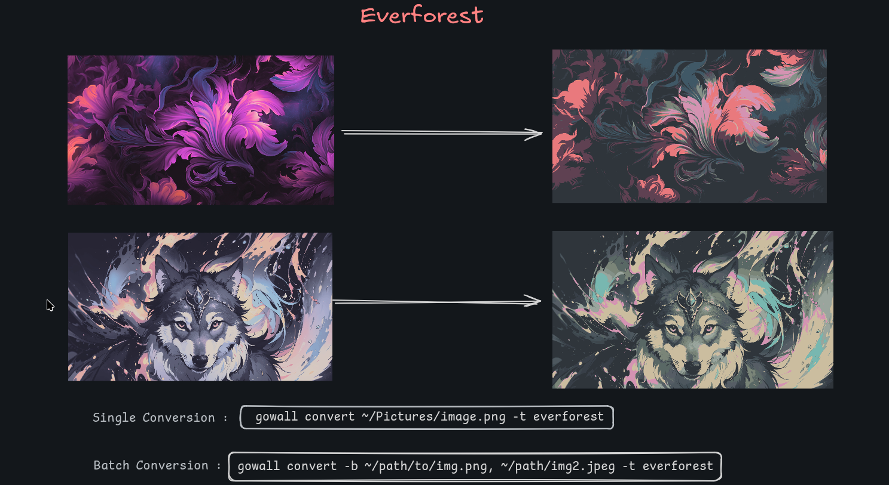

###### *<div align = right><sub>Design By Achno</sub></div>*
<div align = center><br><br>

&ensp;[<kbd> <br> Overview <br> </kbd>](#Overview)&ensp;
&ensp;[<kbd> <br> Themes <br> </kbd>](#Themes)&ensp;
&ensp;[<kbd> <br> Usage <br> </kbd>](#Usage)&ensp;
&ensp;[<kbd> <br> Installation <br> </kbd>](#Installation)&ensp;
&ensp;[<kbd> <br> Contributions <br> </kbd>](#Contributions)&ensp;
<br><br><br><br></div>


```

 ██████╗  ██████╗ ██╗    ██╗ █████╗ ██╗     ██╗         ██████╗ ██╗   ██╗     █████╗  ██████╗██╗  ██╗███╗   ██╗ ██████╗ 
██╔════╝ ██╔═══██╗██║    ██║██╔══██╗██║     ██║         ██╔══██╗╚██╗ ██╔╝    ██╔══██╗██╔════╝██║  ██║████╗  ██║██╔═══██╗
██║  ███╗██║   ██║██║ █╗ ██║███████║██║     ██║         ██████╔╝ ╚████╔╝     ███████║██║     ███████║██╔██╗ ██║██║   ██║
██║   ██║██║   ██║██║███╗██║██╔══██║██║     ██║         ██╔══██╗  ╚██╔╝      ██╔══██║██║     ██╔══██║██║╚██╗██║██║   ██║
╚██████╔╝╚██████╔╝╚███╔███╔╝██║  ██║███████╗███████╗    ██████╔╝   ██║       ██║  ██║╚██████╗██║  ██║██║ ╚████║╚██████╔╝
 ╚═════╝  ╚═════╝  ╚══╝╚══╝ ╚═╝  ╚═╝╚══════╝╚══════╝    ╚═════╝    ╚═╝       ╚═╝  ╚═╝ ╚═════╝╚═╝  ╚═╝╚═╝  ╚═══╝ ╚═════╝ 

```

# Overview :framed_picture:

Gowall is a tool to convert an image ( specifically a wallpaper ) to any color-scheme / pallete you like! 

- It supports `single` and `batch` conversion of images to any of the available themes below.
- It also has the ability to `invert` the colors of the image and convert them later

### Supported formats

`png` `jpeg` `jpg` `webp`

### Planned features

1. `Random mode` : by using this mode your image will be go through some stages randomly
   ex. First invert the colors, then convert to nord theme , then convert to catppuccin etc...
   The end product will be a random wallpaper different from any normal conversion. ~ Use it if you want to discover new Color-schemes or dont like the normal conversion of an image

2. `Extract command` : using this command on an image will extract the color-scheme and give you a pallete of 5 hex color codes ( aka. pywall )

3. `TUI` : Will also have a pretty TUI version made with `bubbletea`
   
<div align = center><br><br>

<div align = center><br><br>

<div align = center><br><br> <div>

<div align = left>
  
# Themes :art:

The currently supported themes are featured below, if your favourite theme is missing open an issue or a pull request

- **Catppuccin Mocha**
- **Nord**
- **Everforest**
- **Solarized**
- **Gruvbox**
- **Dracula**
- **Tokyo-moon**
- **Onedark**

  <br>

# Usage :gear:


1.  `Singe conversion`

  ```bash
    gowall convert path/to/img.png -t <theme-name-lowercase>
  ```

Notes 🗒️ : 
- `path/to/img.png` does not have to be an absolute path. You can use a relative path with the `~` ex. `~/Pictures/img.png` 
- `<theme-name-lowercase>` is one of the above theme names but in `lowercase` ex. `catppuccin`

<br>

2. `Batch conversion`

   ```bash
     gowall convert -b path/img.png,path/im2.png -t <theme-name-lowercase>
   ```
<br>

3. `Invert colors`

   ```bash
    gowall invert path/to/img.png
   ```
   You can also batch invert colors with :

   ```bash
    gowall invert -b path/img.png,path/img2.png
   ```
   
<br> 

# Installation ⬇️

## Arch linux - AUR

```
yay -Sy gowall
```
## Build from source

🔨 Clone the repo, build the project and move it inside your `$PATH`

```
git clone https://github.com/Achno/gowall
cd gowall
go build
sudo cp gowall /usr/local/bin/
gowall
```

Notes 🗒️ : You dont have to use `sudo cp gowall /usr/local/bin/` if you have `$GOPATH` setup correctly
Eg. you have the following in your .zshrc / .bashrc
```bash
export GOPATH=$(go env GOPATH)
export GOBIN=$GOPATH/bin
export PATH=$PATH:$GOBIN
```

# Contributions 🤝

If you wish to contribute by adding a new theme please open an `issue`

I would also be very happy if you can provide the `rgb values` of your theme as well :) but not required if it's popular
